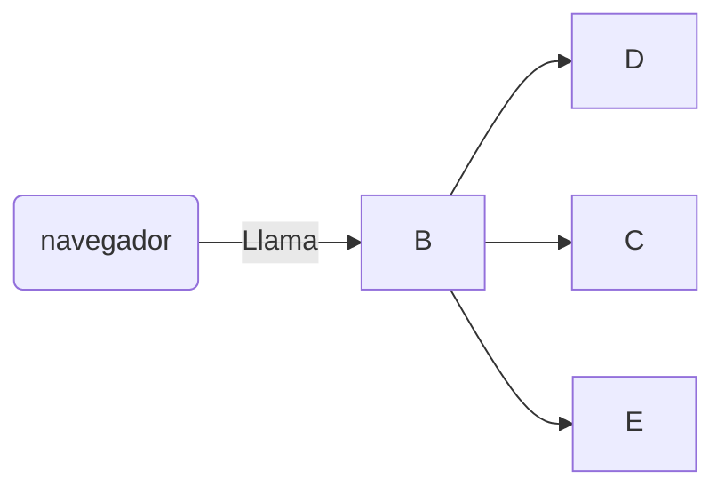

+++
title = 'Extensiones'
date = 2024-10-04T14:00:37+02:00
draft = false
weight = 10
+++


### creando
para usar un shortcode deber de especificarlo con los siguientes 

```
**Texto en negrita** 
```para poner codigo```
```
'''
dentro del codigo podemos poner % o < deberia funcionar bien pero tienen ligeras diferencias
markdown para %
< para html
'''
ejemplo:


**negrita**     

--- 
para escribir codigo html 
{{ `<> }}
---

---
Accede a la web 

---

# mermaid

## Recursos

